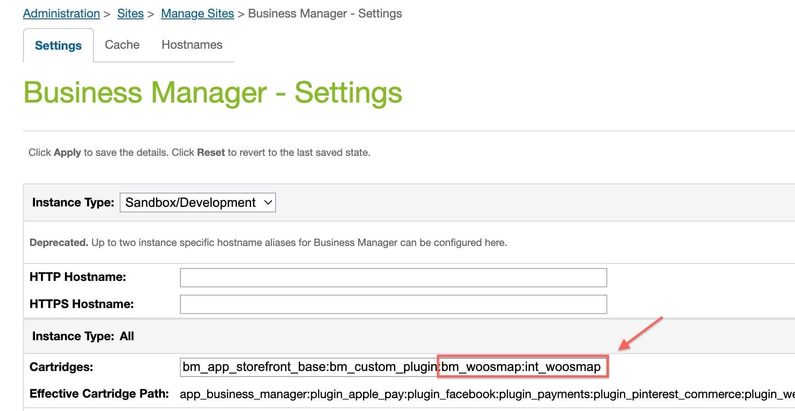
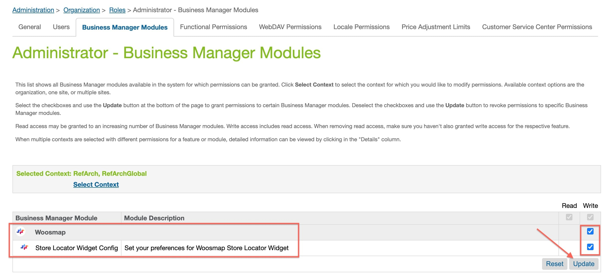

## Summary

Woosmap’s Link Cartridge add to your Salesforce Commerce Cloud website an advanced Store Locator Widget.

To match your preferences and website’s graphic style, all the properties of your Store Locator Widget can be customised
through the Salesforce Business Manager.

This document provides technical instructions for using the Woosmap SFCC Cartridges to integrate the Woosmap Store
Locator Widget into the SFCC storefront.


#### Glossary

| Term                      | Description                                                                  |
|---------------------------|------------------------------------------------------------------------------|
| **SFCC**                  | SalesForce Commerce Cloud                                                    |
| **Business Manager (BM)** | The primary tool used to configure the SFCC platform and customer storefront |
| **SFRA**                  | StoreFront Reference Architecture                                            |

## Component Overview

### Functional Overview {#fonctional-overview}

The Woosmap cartridge allows the customer to connect to a customized Store Locator displaying stores on a map on his website. Woosmap
cartridge replaces the internal SFCC Store Locator with the Woosmap Store Locator Widget.

The following cartridges are available to integrate with your SFCC storefronts:

| Cartridge Name  | Description                                                                                                                   |
|-----------------|-------------------------------------------------------------------------------------------------------------------------------|
| **int_woosmap** | Handles the display of the Woosmap Store Locator Widget in your SFCC website.                                                 |
| **bm_woosmap**  | Allows you to customise the Woosmap Store Locator Widget look and feel to match your preferences and website’s graphic style. |

### Limitations, Constraints

Use of the Woosmap cartridges requires keys from Woosmap. Please register on [Woosmap's website](https://www.woosmap.com/sign_up?utm_source=salesforce_commerce_cloud) and contact
Woosmap customer service.

### Privacy

The Woosmap cartridges does not collect and process user profile information. For additional privacy information, please
contact your Woosmap Account Manager.

## Implementation Guide {#implementation-guide}

### Importing cartridges Using the CLI

The CLI used here is [`sgmf-scripts`](https://github.com/SalesforceCommerceCloud/sgmf-scripts/). You could also upload
the cartridges using [`dw-utils`](https://www.npmjs.com/package/dw-utils) or extensions for IntelliJ IDEA, VS code and
Eclipse.

1. Download the cartridge source from the Partner Marketplace.
2. Unzip the directory.
3. Install the dependencies from the unzipped directory.

```shell
cd /folder/SalesforceCommerceCloud-link_woosmap-...
npm install
```

4. Create a config file called `dw.json` at the root of the project, and add the following content:

```json
{
  "hostname": "<*.demandware.net (without https/http)>",
  "username": "<username>",
  "password": "<password>",
  "code-version": "<code-version>"
}
```

- `hostname` is the hostname you use to access your sandbox, for
  example `"zzte-003.sandbox.us02.dx.commercecloud.salesforce.com"`,
- `username` and `password` are your account manager email and password,
- `code-version` is the name of the active code version in **Administration → Code Deployment**. For
  example, `"SFRA_UPC_05_04_2021"`.

5. Upload the cartridges by executing the following command.

```shell
npm run uploadCartridge
```

6. Verify that the Woosmap cartridges are correctly uploaded by going to **Administration → Development Setup → Folder
   Browser → Cartridges**.

### Enable the cartridges on your site

1. Go to **Administration → Sites → Manage Sites** and select your desired site from the **Storefront Site** list:
   

2. Go to the **Settings** tab. If your site is based on SFRA, add **int_woosmap** at the beginning of your cartridge
   path and apply your modifications.
   

Next, add the cartridge to the Business Manager:

1. Go back to **Administration → Sites → Manage Sites** and click on **Manage the Business Manager Site**.
   

2. Go to the **Settings** tab, and add **bm_woosmap:int_woosmap** at the end of your cartridge path and apply your modifications.
   

### Import metadata

The metadata linked to the cartridge contain mandatory **Custom Preferences** for Woosmap as well as default behaviour
to access the store locator page (a link in the footer).

Before uploading the metadata to your SFCC storefront, adapt the following to youir site:

1. Under `metadata/woosmap/libraries`, rename the folder `RefArchSharedLibrary` to match the ID of your library. 
You will find the ID of your desired library from the **Content Libraries** list going through **Administration → Sites → Content Libraries**.
   

2. Open the `metadata/woosmap/libraries/RefArchSharedLibrary/library.xml` file and rename the `library-id` attribute to
   match your own.
3. Under `metadata/woosmap/sites`, rename the folder `RefArch` to match the ID of your site. 
You will find the ID of your desired site from the **Storefront Site** list going through **Administration → Sites → Manage Sites**.
   
4. Compress as a Zip file the metadata folder `metadata/woosmap`.

You can then upload your metadata.

1. Go to **Administration → Site Development → Site Import & Export**, and upload the `woosmap.zip` archive from the
   metadata folder.

2. To import `woosmap.zip`, select the radio button next to it and click the import button.
   

3. Check the import is successful.
   

After import is successfully done, you should see the new Woosmap Custom Preferences in **Merchant Tools → Site
Preferences → Custom Preferences → Woosmap**.


Select Woosmap and you should see fields for cartridge setup.


| Field                                   | Description                                                                                  |
|-----------------------------------------|----------------------------------------------------------------------------------------------|
| **Enable Woosmap Store Locator Widget** | Activate Woosmap Store Locator Widget in your website                                        |
| **Woosmap Public Api Key***             | Public Api Key for Woosmap                                                                   |
| **Mobile Break Point**                  | Render Store Locator Widget in Mobile View when client screen is under this value (in pixel) |
| **Store Locator Widget Configuration**  | JSON description of Store Locator Widget configuration                                       |

### Activate the Business Manager Extension

In order to access the **BM Woosmap Extension** and configure your preferences, you need to give administrator roles
access to this module.

1. Go to **Administration → Organization → Roles & Permissions**, and click on the *Administrator* role.
   

2. Switch to the **Business Manager Modules** tab, select your site name (e.g. `RefArch` for example), and click **Apply**.

3. Check the checkbox for **Woosmap** and click **Update** button
   

A new menu should now appear in **Merchants Tools**.


To configure the Woosmap Store Locator Widget through the BM extension go to **Merchants Tools → Woosmap → Store Locator
Widget Config**.


## Testing
Check integration test in folder `test/integration/woosmap` and unit test in folder `test/unit/woosmap`.

## Operations, Maintenance
Stores data come from Woosmap APIs. No Stores Data are hosted on SFCC.

### Availibility
When enabled, the cartridge replaces the Store Locator functionality of the SFRA. If the Woosmap service becomes unavailable the Store Locator will not function. In this case, Woosmap cartridgecartridges should be disabled in site preferences, this will bring back the default Store Locator functionality until Woosmap service connectivity issue will be solved.

### Failover/Recovery Process

Stores data come from Woosmap APIs. No Store data is hosted on SFCC therefore no failover/recovery process is proposed.

### Support

For any question regarding the Woosmap functionality, please refer to the [Woosmap online documentation](https://developers.woosmap.com), [support contact form](https://developers.woosmap.com/support/contact/), and [community forum](https://forum.woosmap.com/). 

## User Guide

### Business Manager
See [Implementation Guide](#implementation-guide).

### Storefront Functionality
See Component [Overview → Functional Overview section](#fonctional-overview).

## Known Issues
No known issues.

## Release History

| Version | Date       | Change          |
|---------|------------|-----------------|
| 24.1.0  | 2024-06-18 | Official release|
| 22.1.0  | 2022-04-22 | Initial release |


